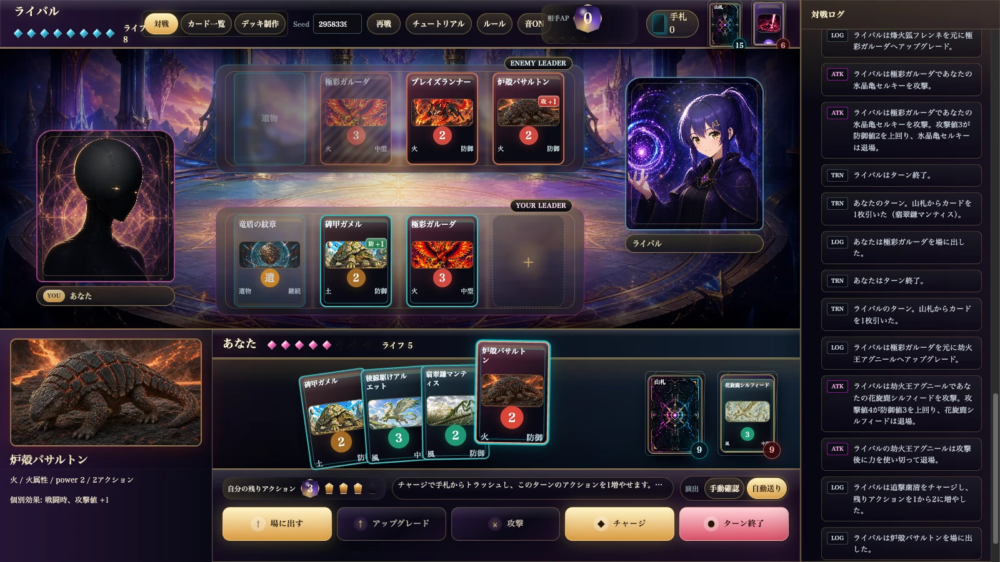

# Break Duel

`Break Duel` は、25 枚デッキで遊ぶ 2 人対戦の小型オリジナルカードゲームです。
React + TypeScript のブラウザ UI で実際に対戦でき、Python シミュレータで自動対戦とバランス検証を回せます。

**▶ ブラウザですぐ遊べます: https://break-duel.pages.dev/duel**

[](https://break-duel.pages.dev/duel)

## 特徴

- 1 試合が短く終わる、軽量な対戦カードゲームです。
- 召喚獣、術式、遺物の 3 種類のカードを使います。
- 各ターンは基本 3 アクションで、カードをチャージすると一時的に 4 アクションまで伸ばせます。
- 防がれなかった攻撃は召喚獣の power と同じ 1〜4 点の突破ダメージを与えます。
- 攻撃ダメージを受けた側は受けた点数分ドローするブレイクドローで反撃資源を得ます。
- 攻撃対象には相手プレイヤーだけでなく、相手の召喚獣も選べます。
- 火、水、風、土の 4 属性は相性補正ではなく、カード個別効果で特徴を出します。
- 手札防御、場防御、アップグレード、遺物、トラッシュ回収などを実装しています。
- ブラウザ UI では固定デッキと保存済みカスタムデッキを、自分側と相手側で個別に選べます。
- 相手 CPU は `初心者` と `挑戦者` から選べます。`挑戦者` は自動探索した評価関数で合法手を比較します。
- Python CLI で大量の自動対戦、リーグ戦、ルール実験を実行できます。

## ゲーム概要

各プレイヤーは 25 枚デッキを使い、召喚獣を場に出して攻撃します。相手のライフを 0 にするか、最大手番後のライフ判定で勝利します。

標準ルール:

- 初期ライフ: 8
- デッキ枚数: 25
- 先攻初期手札: 5
- 後攻初期手札: 5
- 通常アクション数: 3（チャージで最大 4）
- 突破ダメージ: ダメージ = 攻撃召喚獣の power（1〜4 点）。攻撃値補正は防御突破・討伐判定のみ
- ブレイクドロー: 攻撃ダメージを受けた点数分ドロー
- モンスター攻撃: 相手の召喚獣を攻撃対象に選べる（場防御と同じ判定式）。防御側は場の別召喚獣でかばうか、手札防御で割り込める
- 先攻 1 ターン目: 1 アクション、開始時ドローなし、攻撃不可
- 後攻 1 ターン目: 開始時ドローなし、3 アクション、攻撃可能
- 場の召喚獣上限: 3
- 遺物スロット: 1
- 手札防御: 1 回 / ターン（本体への攻撃とモンスター攻撃で共通）
- 最大手番数: 60
- 属性相性補正: なし

カード種別:

| 種別 | 役割 |
| --- | --- |
| 召喚獣 | 場に出して攻撃、防御、アップグレードに使うカード |
| 術式 | 1 回使い切りのアクションカード |
| 遺物 | 1 枚だけ配置できる継続効果カード |

詳しいルールは [docs/game-spec.md](docs/game-spec.md) を参照してください。

## デッキ

ブラウザ UI には 7 つの固定デッキがあります。

| ID | 概要 |
| --- | --- |
| `break` | 火と水を中心にした攻撃圧、妨害、リソース補充のデッキ |
| `control` | 風と土を中心にした防御、再利用、テンポ制御のデッキ |
| `fire` | 火単色。攻撃圧、手札防御への圧力、フィニッシャー重視 |
| `water` | 水単色。手札防御と反復攻撃、手札の質を活かす粘り重視 |
| `wind` | 風単色。消耗操作、テンポ、再攻撃機会重視 |
| `earth` | 土単色。場防御、遺物、防御成功時のリターン重視 |
| `apex` | 挑戦者CPUリーグで採用した混合の最強候補デッキ |

デッキ制作画面では保存デッキを作れます。保存条件は次の通りです。

- 25 枚ちょうど
- 同名カード 2 枚まで
- power 3 以上の召喚獣は合計 5 枚まで

保存デッキはブラウザの `localStorage` に保存されます。

## クイックスタート

必要なもの:

- Node.js
- npm
- Python 3.9 以上

インストール:

```bash
npm install
```

開発サーバーで遊ぶ:

```bash
npm run dev -- --host 127.0.0.1
```

表示されたローカル URL をブラウザで開いてください。通常は `http://127.0.0.1:5173/` です。

本番ビルドを静的配信する:

```bash
npm run build
python3 -m http.server 8000 --directory web
```

`http://localhost:8000/` を開くと、ビルド済み UI で遊べます。ポート 8000 が使用中なら、別のポートを指定してください。

## シミュレーション

ヘッドレスシミュレーション CLI（`src/sim/cli.ts`）はブラウザ UI と同じ TypeScript エンジンを使います。

標準対戦を 1000 戦実行:

```bash
npm run sim -- simulate --games 1000 --seed 1 --out tmp/simulate_1
```

固定デッキ同士を指定:

```bash
npm run sim -- simulate \
  --games 1000 \
  --seed 21001 \
  --out tmp/break_control_21001 \
  --first-deck break \
  --second-deck control
```

CPU モードを指定（`beginner` / `challenger`、省略時は `challenger`）:

```bash
npm run sim -- simulate \
  --games 1000 \
  --seed 730500 \
  --out tmp/challenger_vs_beginner_fire \
  --first-deck fire \
  --second-deck fire \
  --first-ai challenger \
  --second-ai beginner
```

6 デッキの ordered round-robin league:

```bash
npm run sim -- league \
  --games-per-pair 1000 \
  --seed 4200000 \
  --out tmp/six_deck_league_4200000 \
  --decks break control fire water wind earth
```

出力:

- `summary.json`: `simulate` の集計
- `matches.jsonl`: `simulate` の各試合ログ
- `league-summary.json`: `league` の順位表と各組み合わせ結果

ターン上限を変えて比較したい場合は `--max-turns N` を付けます。

挑戦者 CPU の評価重みを自動探索する:

```bash
npm run tune:ai -- \
  --iterations 16 \
  --games-per-seat 10 \
  --seed 730101 \
  --out tmp/ai-profile-tuning.json
```

APEX 候補を自動生成し、現行APEX+上位4候補の5デッキリーグで採用候補を選ぶ:

```bash
npm run tune:apex -- \
  --pool-size 120 \
  --top 4 \
  --screen-games 4 \
  --league-games 100 \
  --seed 810101 \
  --out tmp/apex-tuning.json
```

## バランス回帰チェック

高コスト偏重デッキなどが既存デッキを大きく上回らないかを確認する補助スクリプトがあります。

```bash
npm run balance:cost -- \
  --games-per-order 1000 \
  --seed 3000000 \
  --out tmp/cost-balance.json
```

## テスト

標準チェック:

```bash
npm run check
```

内訳:

- `npm run typecheck`
- `npm run test:unit`
- `npm run build`

カード効果を追加・変更した場合は、TypeScript 側の `src/game/cardEffectCoverage.test.ts` に効果ケースを追加してください。
このテストは有効カードプールに存在する効果 ID とテスト登録表の差分を検知するため、効果を実装してテスト登録を忘れると `npm run test:unit` が失敗します。

## CI

GitHub Actions で 3 つのワークフローが動きます。

| ワークフロー | トリガー | 内容 |
| --- | --- | --- |
| `CI` | push / PR | `npm run check`（typecheck + vitest + build） |
| `Balance Regression` | 毎週土曜朝 JST + 手動実行 | ストレスデッキ回帰 + 6 デッキリーグ。結果はジョブサマリーとアーティファクトに保存 |
| `Deploy` | main の CI 成功後 + 手動実行 | ビルドして Cloudflare Pages へデプロイ |

定期実行のバランス回帰は 200 戦/順の軽量版です。正式なバランスレポートが必要なときは、Actions から `Balance Regression` を `games_per_order=1000` で手動実行してください。

## デプロイ（Cloudflare Pages）

初回のみ、次のセットアップが必要です。

1. Cloudflare ダッシュボードでアカウント ID を控え、`Cloudflare Pages: Edit` 権限の API トークンを作成する。
2. Pages プロジェクトを作成する:

   ```bash
   npx wrangler pages project create break-duel --production-branch=main
   ```

3. GitHub リポジトリにシークレットを設定する:

   ```bash
   gh secret set CLOUDFLARE_API_TOKEN
   gh secret set CLOUDFLARE_ACCOUNT_ID
   ```

以後、main への push で CI が green になると自動デプロイされます。シークレットが未設定の間、`Deploy` ワークフローは何もせずスキップします。

## ドキュメント構成

| 文書 | 役割 |
| --- | --- |
| [docs/game-spec.md](docs/game-spec.md) | ルールの正本。ルール変更時は必ずここを先に更新する |
| [docs/balance-history.md](docs/balance-history.md) | バランス変更の採用判断と検証数値の記録（追記専用） |
| [docs/design-principles.md](docs/design-principles.md) | 守るべき設計原則、却下済みの案、検証の合格基準 |
| [docs/architecture.md](docs/architecture.md) | 実装構成と変更時の手順 |
| [docs/evolution-design.md](docs/evolution-design.md) | 将来の進化候補の設計メモ |
| [docs/archive/](docs/archive/) | 完了済み作業の記録（原則更新しない） |

## プロジェクト構成

```text
src/
  App.tsx         ブラウザアプリ本体
  game.ts         カード定義、設定、ルール補助、自動判断
  game/actions.ts ゲーム操作
  game/*.test.ts  vitest によるルール・カード効果・ガードレールテスト
  sim/            ヘッドレスシミュレーション CLI（simulate / league）
  components/     UI コンポーネント
  styles.css      UI スタイル

scripts/
  tuneAiProfiles.ts CPU評価重みの自動探索
  tuneApexDeck.ts   APEX候補デッキの探索
  runCostBalance.ts ストレスデッキのコストバランス回帰

docs/
  game-spec.md
  balance-history.md
  design-principles.md
  architecture.md
  evolution-design.md
  archive/

web/
  Vite のビルド出力
```

開発者向けの構成メモは [docs/architecture.md](docs/architecture.md) を参照してください。

## アセット

カード画像・ライバルのイラスト/ボイス・セリフなどのオリジナルアセットは、本プロジェクト専用です(All Rights Reserved)。無断での転載・再利用はご遠慮ください。詳細は [LICENSE-ASSETS.md](LICENSE-ASSETS.md) を参照してください。

ブラウザ UI の一部アイコンには Kenney の `Board Game Icons` を使用しています。

- Source: https://kenney.nl/assets/board-game-icons
- License: Creative Commons CC0

ブラウザ UI のBGM・効果音には、以下の CC0 素材を使用しています。詳細は [src/assets/audio/README.md](src/assets/audio/README.md) を参照してください。

- Chiptune Battle Music
- JRPG Epic Rock Battle Theme #1
- Menu Music
- Kenney Casino Audio
- Kenney Impact Sounds
- Kenney Interface Sounds
- Card Game Sounds
- Level Up, Power Up, Coin Get (13 Sounds)

## ライセンス

このリポジトリは、対象ごとにライセンスが異なります。

| 対象 | ライセンス |
| --- | --- |
| ソースコード | Break Duel Source Available License([LICENSE](LICENSE)) |
| オリジナルアセット(カード画像、ライバルのイラスト・ボイス、セリフなどのゲームテキスト) | Break Duel Source Available License / 権利留保([LICENSE-ASSETS.md](LICENSE-ASSETS.md)) |
| 第三者素材(Kenney アイコン、BGM・効果音) | CC0(出典は上記アセット節を参照) |

このライセンスは OSI 承認のオープンソースライセンスではありません。ゲームをプレイ・学習・非商用で改造・本プロジェクトへ貢献する範囲での利用は許可しています。一方で、Break Duel のコード、カードデータ、ルール表現、ゲームテキスト、アセットを利用した商用ゲーム・アプリ・サービス・素材集・データセット等の公開、販売、広告収益化、サブスクリプション化、アプリ内課金化は、事前の書面許可なしには許可していません。
